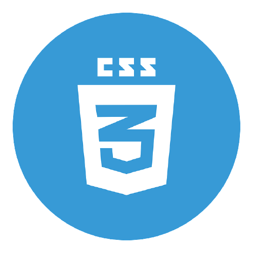
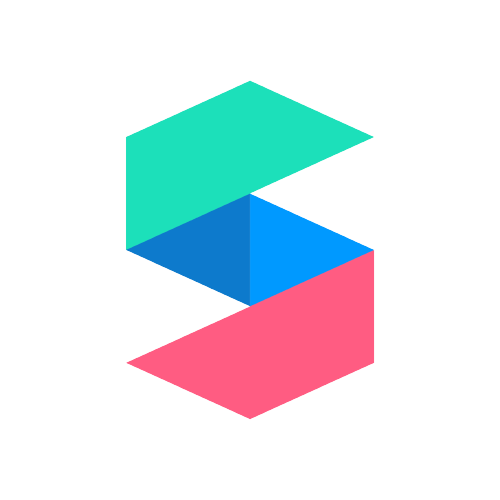
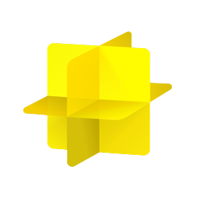

<h2>नमस्ते (Namaste)🙏🏻
  I'm Ekansh Mittal ! </h2>
<h3 align="left">An Immersive Reality Enthusiast learning and developing apps in the field of AR, VR, XR.</h3>

  

- :office: &nbsp;I'm currently **open for new opportunities**.
- :seedling: &nbsp;I’m currently learning **React**
- :speech_balloon: &nbsp;I like to talk about **AR** and **WebAR**
- :mailbox: &nbsp;Ask me anything on my **[issues page]**
- :computer: &nbsp;Connect with me on **[LinkedIn]**

 

<h2 align="left" id="yaugan-tech">🌟 Favorite Tech</h2>

> Tools, languages, and other things that I like to work with.

<table>
  <tr>
    <td align="center" width="96">
      
       C#&nbsp;
    </td>
    <td align="center" width="96">
      
       Python
    </td>
    <td align="center" width="96">
      
       Unity
    </td>
    <td align="center" width="96">
      
       JavaScript
    </td>
    <td align="center" width="96">
      
       React
    </td>
    <td align="center" width="96">
      
       Bootstrap
    </td>
  </tr>
  <tr>
    <td align="center" width="96">
      
       HTML
    </td>
    <td align="center" width="96"> 
      
       CSS
    </td>
    <td align="center" width="96">
      
       Unreal
    </td>
    <td align="center"  width="96">
      
       SparkAR
    </td>
    <td align="center"  width="96">
      
       Lens
    </td>
    <td align="center" width="96">
      
       Blender
    </td>
  </tr>
</table>

<h2 align="left" id="yaugan-tech">☄️ Github Streaks</h2>

<h2 align="left" id="yaugan-tech">💻 Most Used Languages</h2>

<!-- links -->
[issues page]: https://github.com/Yaugan/Yaugan/issues "Yaugan/issues"
[linkedin]: https://www.linkedin.com/in/ekansh-mittal/ "Ekansh Mittal LinkedIn"
